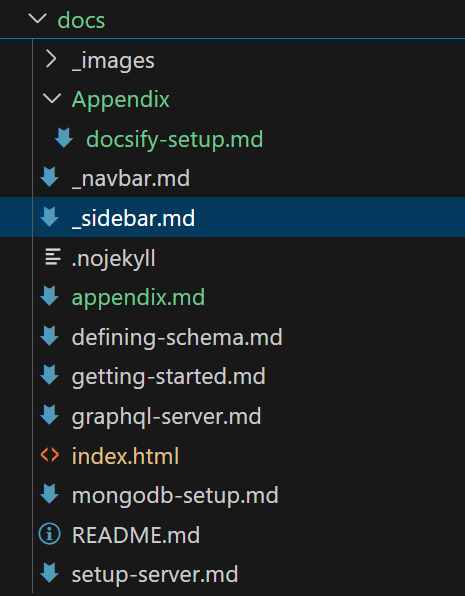
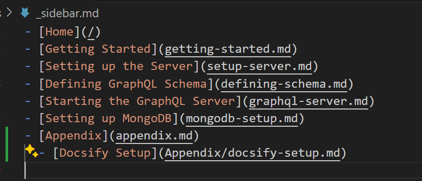

# Docsify Setup Guide

This guide will help you duplicate the current Docsify setup for a new project, creating a template that includes all necessary steps and files. Follow these instructions to replicate the Docsify environment used in the Madiyan project.

## Prerequisites

- Node.js installed on your system.
- Basic knowledge of Markdown and HTML.

## Step 1: Install Docsify CLI

Docsify CLI is a tool that helps you to quickly create and manage Docsify projects. Install it globally using npm:

```bash
npm i docsify-cli -g
```

## Step 2: Initialize Your Project

Create a new directory for your project and navigate into it (You can skip, if you already have a project directory):

```bash
mkdir my-new-docsify-project
cd my-new-docsify-project
```

Initialize a Docsify project:

```bash
docsify init ./docs
```

This command creates a `docs` directory with an `index.html` file, which is the entry point of your documentation site.

## Step 3: Customize `index.html`

Replace the content of `docs/index.html` with the setup from the Madiyan project. Ensure to include the following customizations from the original `index.html`:

- Custom meta tags for description, viewport, etc.
- External CSS links for Docsify theme, Docsify darklight theme, Google Fonts, and Highlight.js.
- Custom styles for `.navbar` and `.navbar-brand`.

```html
<!DOCTYPE html>
<html lang="en">
  <head>
    <meta charset="UTF-8" />
    <title>Madiyan</title>
    <meta http-equiv="X-UA-Compatible" content="IE=edge,chrome=1" />
    <meta name="description" content="Description" />
    <meta
      name="viewport"
      content="width=device-width, initial-scale=1.0, minimum-scale=1.0"
    />
    <link
      rel="stylesheet"
      href="//cdn.jsdelivr.net/npm/docsify@4/lib/themes/vue.css"
    />
    <link
      rel="stylesheet"
      href="//cdn.jsdelivr.net/npm/docsify-darklight-theme@3/dist/index.css"
    />
    <link
      rel="stylesheet"
      href="https://fonts.googleapis.com/css2?family=Roboto:wght@400;700&display=swap"
    />
    <link
      rel="stylesheet"
      href="//cdnjs.cloudflare.com/ajax/libs/highlight.js/11.3.1/styles/github.min.css"
    />
    <link
      rel="stylesheet"
      href="//cdn.jsdelivr.net/npm/docsify/themes/dark.css"
    />
    <link
      rel="stylesheet"
      href="https://cdn.jsdelivr.net/npm/docsify-darklight-theme@3.2.0/dist/style.min.css"
    />
    <style>
      .navbar {
        background-color: #ffcccc !important; /* Light red background */
        padding: 10px;
      }
      .navbar-brand {
        font-size: 24px;
        font-weight: bold;
        color: #000;
      }
    </style>
  </head>
  <body>
    <div id="app"></div>
    <script>
      window.$docsify = {
        name: "Madiyan",
        repo: "",
        loadSidebar: true,
        loadNavbar: true,
        subMaxLevel: 2, // Show sub-headers up to level 2 (##)
        auto2top: true, // Automatically jump to the top of the document when navigating
        alias: {
          "/.*/_sidebar.md": "/_sidebar.md",
        },
        plugins: [
          function (hook, vm) {
            hook.afterEach(function (html, next) {
              next(html + "<script>hljs.highlightAll();<\/script>");
            });
          },
        ],
      };
    </script>
    <script src="//cdn.jsdelivr.net/npm/docsify@4"></script>
    <script src="//cdn.jsdelivr.net/npm/docsify-darklight-theme@3/dist/index.js"></script>
    <script src="//cdn.jsdelivr.net/npm/docsify-copy-code@2/dist/docsify-copy-code.js"></script>
    <script src="//cdnjs.cloudflare.com/ajax/libs/highlight.js/11.3.1/highlight.min.js"></script>
    <script src="https://cdn.jsdelivr.net/npm/docsify-darklight-theme@3.2.0/dist/index.min.js"></script>
    <script src="//cdn.jsdelivr.net/npm/docsify/lib/plugins/zoom-image.min.js"></script>
    <script src="//unpkg.com/docsify-sidebar-collapse/dist/docsify-sidebar-collapse.min.js"></script>
  </body>
</html>
```

## Step 4: Add Content

Create Markdown files inside the `docs` directory for your documentation content. For example, create a `README.md` as your homepage:

```markdown
# Welcome to My Project

This is the homepage of my project documentation.
```

## Step 5: Custom Navbar and Sidebar

To add a navbar, create a `_navbar.md` in the `docs` directory:

```markdown
- [Home](/)
- [GitHub](https://github.com)
```

Given below shows my docs folder structure and sample sidebar based on that.





## Step 6: Run Your Docsify Site

Start a local server with Docsify CLI:

```bash
docsify serve docs
```

Your documentation site will be available at `http://localhost:3000`.

## Step 7: Deployment

For deployment, you can use GitHub Pages, Netlify, or any static site hosting service. Ensure to deploy the `docs` directory.

## Additional Customizations

Refer to the Docsify documentation for further customizations, including plugins, themes, and advanced configurations.

## Conclusion

You've now duplicated the Docsify setup from the Madiyan project for your new project. This guide provided a template to get started with Docsify, including steps and necessary files. Customize it further to fit your project's needs.
